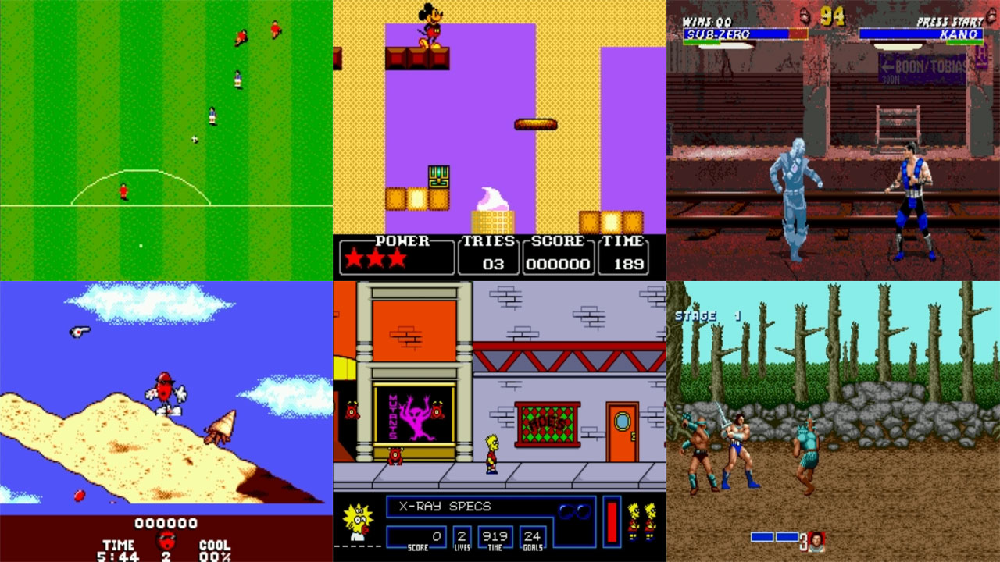

# Sega - MS/GG (SMS Plus GX)

### Description

SMS Plus GX is a port of the original Sega Master System emulator for the Nintendo GameCube.

### License

GPLv2

### Icon

### Fanart

Help make me fanart!

### Screenshots

### Disclaimer

*Ported to libretro by gameblabla*
